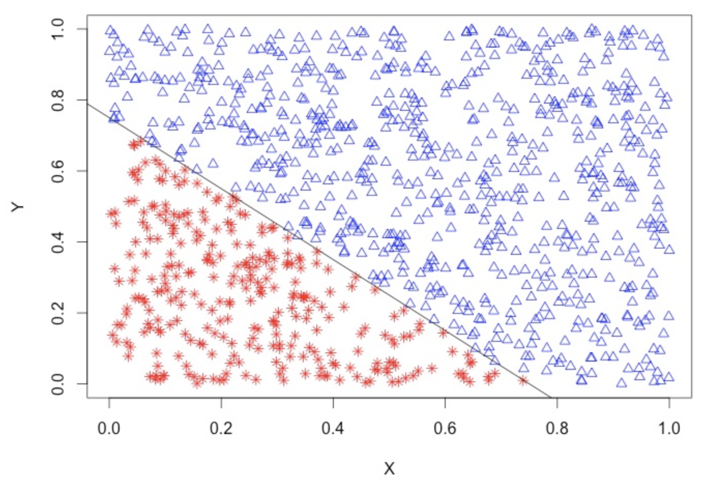
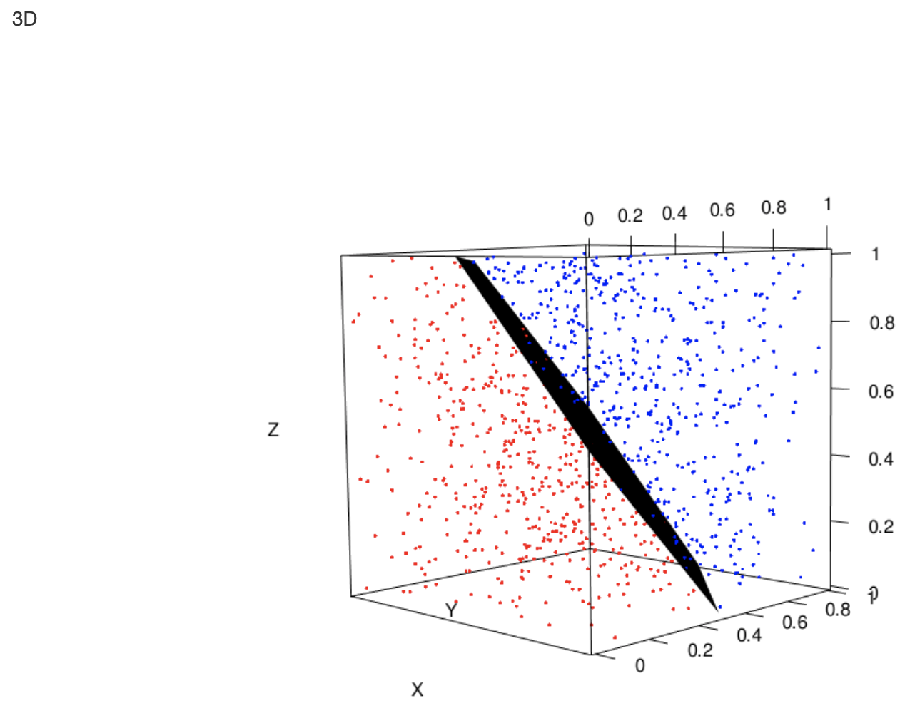
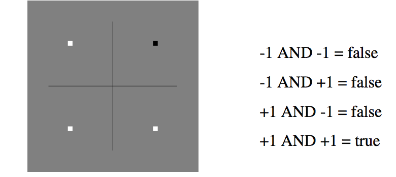

# Introduction

*In machine learning, the perceptron is an algorithm for supervised learning of binary classifiers (functions that can decide whether an input, represented by a vector of numbers, belongs to some specific class or not). It is a type of linear classifier, i.e. a classification algorithm that makes its predictions based on a linear predictor function combining a set of weights with the feature vector. The algorithm allows for online learning, in that it processes elements in the training set one at a time*(@perceptron) 

This model can solve linearly separable problems. Examples:

2D



3D



**When a problem is linearly non-separable, the Perceptron algorithm will not converge.**

The perceptron is a **key concept** in Neural Networks.

# The algorithm

The perceptron learning algorithm was developed by @rosenblatt.

This algorithm tries to find a separating hyperplane by minimizing the distance (i.e. euclidean distance, but there are many options) of misclassified points to the decision boundary. It starts with an initial guess as to the separating plane’s parameters and then updates that guess when it makes mistakes.

Visual representation (@murrell):


A perceptron defines a hyperplane in n+1 dimensional space:

$y = w_nx_n + w_{n-1}x_{n-1} + ... + w_1x_1 + w_0$

AND example:



The algorithm is the following:

```{r, eval = FALSE}
# w, x, y are vectors

initialize w = 0

# b parameter must also be included for the peceptron algorithm to deliver a valid separator.
# for incorrectly classified training samples b must be adjusted, too:

while any training observation (x, y) is not classified correcty {
  set w = w + learning_rate * yx
  set b = b + learning_rate * yR^2
  # where R is some constant larger than the distance from the
  # origin to the furtherest training sample
}
```

## Coding the algorithm
```{r}
library(ggplot2)
DistanceFromPlane = function(z, w, b) {
  sum(z * w) + b
}

ClassifyLinear = function(x, w, b) {
  distances = apply(x, 1, DistanceFromPlane, w, b)
  return(ifelse(distances < 0, -1, +1))
}
 
EuclideanNorm <- function(x) {
  return(sqrt(sum(x * x)))
}

PerceptronFunction <- function(x, y, learning.rate = 1) {
  w = vector(length = ncol(x)) # initialize w
  b = 0 # Initialize b
  iterations = 0 # count iterations
  cost_function <- c()
  R = max(apply(x, 1, EuclideanNorm))
  convergence = FALSE # to enter the while loop
  while (!convergence) {
    convergence = TRUE # hopes luck
    yc <- ClassifyLinear(x, w, b)
    for (i in 1:nrow(x)) {
      if (y[i] != yc[i]) {
        convergence <- FALSE
        w <- w + learning.rate * y[i] * x[i,]
        b <- b + learning.rate * y[i] * R^2
        iterations <- iterations + 1
        # cost_function <- c(cost_function,sum(y != yc))

      }
    }
  }
s = EuclideanNorm(w)
print(s)
# cost_function <- c(cost_function,sum(y != yc))
# cost_function <- as.data.frame(cost_function)
# ggplot(data=cost_function, aes(x=seq(1,length(cost_function)), y= cost_function, group=1)) +
#     geom_line(color="red")+
#     geom_point()+
#     xlab("Iterations")
return(list(w = w/s, b = b/s, steps = iterations))
}
```

Generate data:
```{r}
# very easy
# x2 = x1 + 1/2
set.seed(1234)
x1 <- runif(100,-1,1)
x2 <- runif(100,-1,1)
x <- cbind(x1,x2)
y <- ifelse(x2 > 0.5 + x1, +1, -1)

PlotData <- function(x, y) {
  plot(x, pch = ifelse(y > 0, "+", "-"), xlim = c(-1,1), ylim = c(-1,1), cex = 2)
  abline(0.5,1)
  points(c(0,0), c(0,0), pch = 19)
  lines(c(0,-0.25), c(0,0.25), lty = 2)
  arrows(-0.3, 0.2, -0.4, 0.3)
  text(-0.45, 0.35, "w", cex = 2)
  text(-0.0, 0.15, "b", cex = 2)
}

PlotData(x, y)
```

Test the perceptron
```{r}
the_perceptron <- PerceptronFunction(x,y)
predicted_y <- ClassifyLinear(x, the_perceptron$w, the_perceptron$b)
# error
print(sum(abs(y - predicted_y)))
```

# Assignment
## 1. Try other learning rates. Which one is the cost function? Explain the algorithm (help): http://www.dbs.ifi.lmu.de/Lehre/MaschLernen/SS2014/Skript/Perceptron2014.pdf)

Learning.rate is the learning rate of the perceptron. Learning rate is between 0 and 1, larger values make the weight changes more volatile. 
The learning rate is a hyperparameter that controls how much to change the model in response to the estimated error each time the model weights are updated (adjusting "w" and "b"). Choosing the learning rate is challenging as a value too small may result in a long training process that could get stuck, whereas a value too large may result in learning a sub-optimal set of weights too fast or an unstable training process.(@LearningRate)

### Trying other learning rates:
```{r}
# Trying other learning rates.
#############
lr = 0.00001#
#############

start_time <- Sys.time()
the_perceptron <- PerceptronFunction(x,y,learning.rate = lr)
predicted_y <- ClassifyLinear(x, the_perceptron$w, the_perceptron$b)
# error
print(sum(abs(y - predicted_y)))
end_time <- Sys.time()
# end_time - start_time
# Time difference of 4.836457 secs  with a learning.rate = 0.5
# Time difference of 4.883949 secs  with a learning.rate = 0.89.
# Time difference of 4.891064 secs  with a learning.rate = 0.99999
# Time difference of 4.894685 secs with a learning.rate = 0.00001
# Time difference of 4.941519 secs with a learning.rate = 0.0001
# Time difference of 5.081375 secs with a  learning.rate = 1.
```
### Explaining the algorithm:

Given:

- x: a set of elements x (defined by their respective coordenates (x1,x2)) over a plane (plane defined by the two dimensions x1 and x2).

- y: a real classification of these elements, that assigns a +1 or -1 to each one of the elements.

- learning rate: explained before.

The PerceptronFunction changes iteratively the parameters "w" and "b" (responsible of adjusting a line and assuming that we can linearly separate the given elements x) until all elements are properly separeted by a line. We know that the line is correctly separating the elements when:

- The cost function reaches the minimum value of 0.

- Which is the same as having all the elements with the same classification (yc) as the real one, known as y.

- Which is the same as converging.


More in depth:

- We first calculate a new proposed classification "yc" (using ClassifyLinear function, using the "w" and "b" that we have),  that we are going to compare with the real classification "y".

- Each time we find a missclassified element while going along all the different elements x, we are going to adjust "w" and "b" a little bit.

- Once we finish the comparison of "y" and "yc" for all our elements x while at the same time we were adjusting "w" and "b". We recalculate a new proposed classification "yc" with the last "w" and "b" calculated and follow the same process along all the elements x until we converge.


The way we calculate:

- A new proposed classification "yc" using ClassifyLinear function is by offering a new plane (defined by the last calculated "w" and "b") and calculating the distances from our elements to this plane. And depending on the distance, assigning as a proposed classification a +1 or -1.

- "w" is by using the learning.rate, the real classification "y" and the current missclassified element x. Readjusting this way the slope of our line defined by x2 = -w[1]* w[2] * x1 - b/w[2].

- "b" is by using the learning.rate, the real classification "y" and the square of R, being R the max distance between the origin of coordenates and one of our elements (the one further away from coordenates).


### The cost function is:

$$
\operatorname{cost}=-\sum_{i \in \mathcal{M}} y_{i} h_{i}=\sum_{i=1}^{N}\left|-y_{i} h_{i}\right|_{+}
$$
Having in mind that $h_{i}$ (proposed classification) and $y_{i}$ ( classification rule, also known as target) can both only have values -1 or 1. Based on the rule y <- ifelse(x2 > 0.5 + x1, +1, -1) that means that if the element is above the line gets a value of +1 and if the element is below the line gets a value of -1. And also knowing that elements are defined by (x1,x2).(@costfunction)(@epoch)

When the proposed classification by  $h_{i}$ is right, the cost= 0. This is why:

$-y_{i}h_{i}$ will be -1 if $h_{i}$ is well classified ($h_{i} = y_{i}$), because if $y_{i}h_{i}$:

- Both with negative values, will give us as a result a positive number. Which due to the "-" in front of them $-y_{i}h_{i}$  will give a -1.

- Both with positive values, will give us as a result a positive number. Which due to the "-" in front of them $-y_{i}h_{i}$  will give a -1.

These operators $\left|\right|_{+}$ mean that $|a r g|_{+}=\max (a r g, 0)$, so that the result of $\left|-y_{i} h_{i}\right|_{+}$ will give:

- A max value "0", if we get a negative number like "-1"as the argument. Giving as a result cost = 0 when  $h_{i}$ is right, classifying well.


When the proposed classification by  $h_{i}$ is wrong, the cost> 0. This is why:

$-y_{i}h_{i}$ will be -1 if $h_{i}$ is well classified ($h_{i} = y_{i}$), because if $y_{i}h_{i}$:

- $h_{i}$ with negative value and $y_{i}$ with positive value, will give us as a result a negative number. Which due to the "-" in front of them $-y_{i}h_{i}$  will give a +1.

- $h_{i}$ with positive value and $y_{i}$ with negative value, will give us as a result a negative number. Which due to the "-" in front of them $-y_{i}h_{i}$  will give a +1.


These operators $\left|\right|_{+}$ mean that $|a r g|_{+}=\max (a r g, 0)$, so that the result of $\left|-y_{i} h_{i}\right|_{+}$ will give:

- A max value equal to the argument if this is bigger than "0". Giving as a result cost > 0 when  $h_{i}$ is wrong, wrong classification.

```{r}
PerceptronFunction <- function(x, y, learning.rate = 1) {
  w = vector(length = ncol(x)) # initialize w
  b = 0 # Initialize b
  iterations = 0 # count iterations
  cost_function <- c()
  R = max(apply(x, 1, EuclideanNorm))
  convergence = FALSE # to enter the while loop
  while (!convergence) {
    convergence = TRUE # hopes luck
    yc <- ClassifyLinear(x, w, b)
    for (i in 1:nrow(x)) {
      if (y[i] != yc[i]) {
        convergence <- FALSE
        w <- w + learning.rate * y[i] * x[i,]
        b <- b + learning.rate * y[i] * R^2
        iterations <- iterations + 1
        cost_function <- c(cost_function,sum(y != yc))
      }
    }
  }

cost_function <- c(cost_function,sum(y != yc))
cost_function <- as.data.frame(cost_function)
ggplot(data=cost_function, aes(x=seq(1,length(cost_function)), y= cost_function)) +
    geom_line(color="red")+
    geom_point()+
    xlab("Iterations")+
    ylab("Cost")+
    ggtitle("Cost Function")
}

PerceptronFunction(x,y,learning.rate = 0.00001)
```


## 2. Try to plot the plane (or the line) every *z* iterations.

We need to modify PlotData:

- Giving it as parameters: w and b, the ones we are changing on each iteration to find the right classification.

- abline: giving it the intercept -b/w[2] and the slope -w[1]/w[2] of the line defined by
x2 = -w[1]* w[2] * x1 - b/w[2]. 

```{r}
PlotData <- function(x, y, w, b) {
  plot(x, pch = ifelse(y > 0, "+", "-"), xlim = c(-1,1), ylim = c(-1,1), cex = 2)
  abline(-b/w[2],-w[1]/w[2])
  points(c(0,0), c(0,0), pch = 19)
  lines(c(0,-0.25), c(0,0.25), lty = 2)
  arrows(-0.3, 0.2, -0.4, 0.3)
  text(-0.45, 0.35, "w", cex = 2)
  text(-0.0, 0.15, "b", cex = 2)
}
```
In order to plot the line on each iteration we need to modify the PerceptronFunction adding the PlotData that will get the new "w" and "b" adjusted on each new iteration.

In order to see results well, we want to see the line when it is inside the value interval of our elements to classify. This is when x1 = 0 and x2 < 1, so when x2 < -b/w2, as our line is defined by x2 = -w1*w2 * x1 - b/w2. 
```{r}


PerceptronFunction <- function(x, y, learning.rate = 0.001) {
  w = vector(length = ncol(x)) # initialize w
  b = 0 # Initialize b
  iterations = 0 # count iterations
  cost_function <- c()
  R = max(apply(x, 1, EuclideanNorm))
  convergence = FALSE # to enter the while loop
  while (!convergence) {
    convergence = TRUE # hopes luck
    yc <- ClassifyLinear(x, w, b)
    for (i in 1:nrow(x)) {
      if (y[i] != yc[i]) {
        convergence <- FALSE
        w <- w + learning.rate * y[i] * x[i,]
        b <- b + learning.rate * y[i] * R^2
        iterations <- iterations + 1
        cost_function <- c(cost_function,sum(y != yc))
        # In order to see results well, we want to see the line when it is inside the value interval of our elements to classify. This is when x1 = 0 and x2 < 1, son when x2 < -b/w2, as our line is defined by x2 = -w1*w2 * x1 - b/w2.
        if((-b/w[2])<1){PlotData(x,y, w, b)}
      
      }
    }
  }
  cost_function <- c(cost_function,sum(y != yc))
  cost_function <- as.data.frame(cost_function)
  # ggplot(data=cost_function, aes(x=seq(1,length(cost_function)), y= cost_function, group=1)) +
  #     geom_line(color="red")+
  #     geom_point()+
  #     xlab("Iterations")
}
PerceptronFunction(x, y, learning.rate = 1)
```


The real classification we must reach has the following rule:

- y <- ifelse(x2 > 0.5 + x1, +1, -1)

Which in turn has the following line equation:

- $x2=x1+1/2$

Our proposed line equation is defined by $x2 = -w[1]/w[2]x1 - b/w2$:

Perceptron will reach convergence once we get "w" and "b" so that the line that it builds is similar to the line equation defined by the classification rule:

- $-b/w[2] 	\approx 1/2$
- $-w[1]/w[2]x1 \approx x1$

```{r  echo = FALSE, message = FALSE, warning = FALSE}
PerceptronFunction <- function(x, y, learning.rate = 1) {
  w = vector(length = ncol(x)) # initialize w
  b = 0 # Initialize b
  iterations = 0 # count iterations
  # cost_function <- c()
  R = max(apply(x, 1, EuclideanNorm))
  convergence = FALSE # to enter the while loop
  while (!convergence) {
    convergence = TRUE # hopes luck
    yc <- ClassifyLinear(x, w, b)
    for (i in 1:nrow(x)) {
      if (y[i] != yc[i]) {
        convergence <- FALSE
        w <- w + learning.rate * y[i] * x[i,]
        b <- b + learning.rate * y[i] * R^2
        iterations <- iterations + 1
        # cost_function <- c(cost_function,sum(y != yc))

      }
    }
  }
s = EuclideanNorm(w)
# print(s)
# cost_function <- c(cost_function,sum(y != yc))
# cost_function <- as.data.frame(cost_function)
# ggplot(data=cost_function, aes(x=seq(1,length(cost_function)), y= cost_function, group=1)) +
#     geom_line(color="red")+
#     geom_point()+
#     xlab("Iterations")
return(list(w = w/s, b = b/s, steps = iterations))
}
pf <- PerceptronFunction (x, y, learning.rate = 0.001)

# - $-b/w[2] = 1/2$
# - $-w[1]/w[2]x1 = x1$
cat("-b/w[2] == 1/2?:", -pf$b/pf$w[2],"\n")
cat("-w[1]/w[2]x1 == x1?:", -pf$w[1]/pf$w[2])


```

It won't probably get the exact values as we can find infinit lines that already separate our elements.

<!-- NO. 3. Try another example with new random data (please, do not use the iris data). Use a *complex* dataset looking for a non-completely linearly separated sample.  -->


# References

---
references:
- id: templxate
  title: Binary classification
  author:
  - family: Fenner
    given: Martin
  container-title: Nature Materials
  volume: 11
  URL: 'http://dx.doi.org/10.1038/nmat3283'
  DOI: 10.1038/nmat3283
  issue: 4
  publisher: Nature Publishing Group
  page: 261-263
  type: article-journal
  issued:
    year: 2012
    month: 3
    
- id: perceptron
  title: Perceptron
  author:
  - family: Wikipedia - Perceptron
  URL: 'https://en.wikipedia.org/wiki/Perceptron'
  issued:
    year: 2017

- id: rosenblatt
  title: The Perceptron. A Probabilistic Model for Information Storage and Organization in the Brain
  author:
  - family: Rosenblatt
  given: Frank
  container-title: Psychological Review
  volume: 65
  issue: 6
  publisher: American Psychological Association
  page: 386–408
  type: article-journal
  issued:
    year: 1958

- id: murrell
  title: Linear Classifiers and the Perceptron Algorithm
  author:
  - family: Murrell
  given: Hugh
  URL: 'http://www.cs.ukzn.ac.za/~hughm/dm/content/slides07.pdf'
  issued:
    year: 2017
    
- id: costfunction
  title: Cost Function
  author:
  - family: LMU
  given: Lm
  URL: 'https://www.dbs.ifi.lmu.de/Lehre/MaschLernen/SS2014/Skript/Perceptron2014.pdf'
  issued:
    year: 2014
    
  
 
- id: epoch
  title: epoch
  author:
  - family: rpubs
  given: rpubs_faihas
  URL: 'https://rpubs.com/FaiHas/197581'
  issued:
    year: 2016    
---